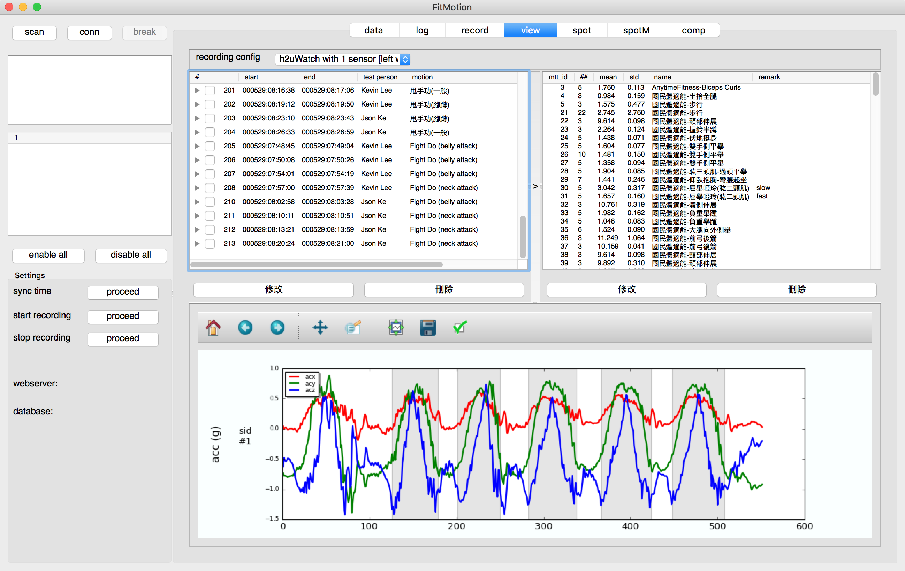

open FitMotion as client
~~~~~~~~~~~~~~~~~~~~~~~~

.. code-block:: bash

   $ python main.py

optimization 
~~~~~~~~~~~~
1. simple script

---bash---

.. code-block:: bash

   $ python motion_optimize.py --mtt_id_train=55 --mc_id=1 --max_iter=10

---ipython---

.. code-block:: ipython
    
   In [1]: %run motion_optimize.py --mtt_id_train=55 --mc_id=1 --max_iter=2
   In [2]: warp_model.warp.test_template_from_db(dbb,event_ids[0],synchronizer,threshold)

2. hyperopt usign mogno: parallel computing for signle job

3. run modelgen server

